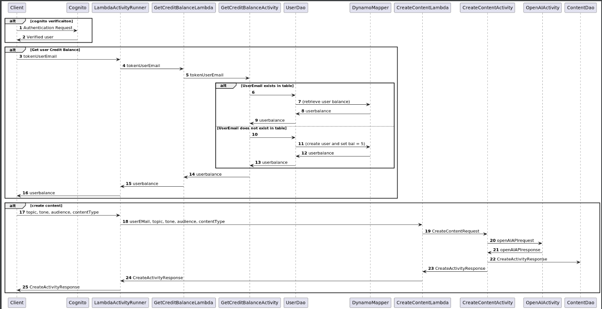

# Project Design Doc - Inspire My Social Service Design

## 1. Problem Statement

&nbsp;&nbsp;&nbsp;&nbsp;&nbsp;&nbsp;A mortgage loan officer in today's social media driven world needs to generate content daily on FaceBook, LinkedIn, Twitter, and YouTube in order to stay in front of clients, and grow their sphere of influence in the market. However it is often time consuming and difficult for the average loan officer to balance the time involved in creating the content consistently and still grow their business, conduct client meetings, manage partner relationships, and proactively manage their pipeline of loans that are under contract. Chat GPT can assist with this, however it is not easy to create polished content for the average user. Utilizing detailed prompts provided as part of the API call to ChatGPT allows one of Inspire My Social's users to create the social media topic quickly and efficiently. This Service will allow users to create posts for FB, Twitter, YT shorts, YT Long content, and LinkedIn using OpenAI’s APIs, store the results in a DynamoTable, and review their prior posts. I intend to have a user Table as well as a GSI tracking available token balances. Each time a prompt is generated the user's available token balance would decrease.


## 2. Top Questions to Resolve in Review

&nbsp;&nbsp;&nbsp;&nbsp;&nbsp;&nbsp;1) Should a db be used to store user data or just retain in Cognito? A lambda trigger can be used to save info into DDB after user confirms signup

&nbsp;&nbsp;&nbsp;&nbsp;&nbsp;&nbsp;2) Will the instructional staff allow me to make calls to a third party service such as OpenAI and Stripe API in my capstone?

&nbsp;&nbsp;&nbsp;&nbsp;&nbsp;&nbsp;3) API design question. Should each type of content created have it's own API or one of the attributes passed into my service would be which type of content is being created?


## 3. Use Cases

u1) Allow end user to create free account

u2) Allow end user to check token balance

u3) Allow end user to create content for FB

u4) Allow end users to see paginated results on Dashboard of their search items, with-pop up button for each of the scripts creating tools.

u5) Allow end user to create content for Twitter

u6) Allow end user to create content for LinkedIn

u7) Allow end user to create content for YT long form

u8) Allow end user to create content for YT Short

u9) Allow end user to upgrade account or “buy tokens (Stripe has an API that is free to use and comes with dummy data. For the scope of this project I would use the dummy account and dummy info only.)


## 4. Project Scope

### 4.1. In Scope

&nbsp;&nbsp;&nbsp;&nbsp;A) Create and retrive social media content created using ChatGPT

&nbsp;&nbsp;&nbsp;&nbsp;B) Tracking and updating a user's token balance when they process a request to create content, or when they "dummy buy" more tokens. Allow an employee account to add more tokens

&nbsp;&nbsp;&nbsp;&nbsp;C) Retrieving all content a user previously created

&nbsp;&nbsp;&nbsp;&nbsp;D) Allow employee account to make revisions to hidden system prompts for each type of content

### 4.2. Out of Scope

&nbsp;&nbsp;&nbsp;&nbsp; Updateing previously created content

&nbsp;&nbsp;&nbsp;&nbsp; setting up monthly subscription for tokens

&nbsp;&nbsp;&nbsp;&nbsp; Allowing employee to create new content types.

## 5. Proposed Architecture Overview

This initial iteration will provide the minimum lovable product (MLP) including creating an account, generating a prompt, retrieving your token balance, and updating account type.

We will use API Gateway and Lambda to create five endpoints (`GetContentbyUser`,`UpdateUserCreditBalance`,
`CreateContent`, `DeleteContent`, `CreateAccount`, `GetCreditBalance`,)

that will handle the creation, update, and retrieval of social media content to satisfy our requirements.

We will store content generated by a user in DynamoDB. users themselves will be stored in Cognito, but a lambda trigger will be used to popualte the user table. 

InspireMySocial will also provide a web interface for users to manage
their accounts and access/generate content. A main page providing a list view of all of their prior content created
will let them create new content 

## 6. API

### 6.1. Public Models

```
// ContentModel

String userId;
String contentId;
String contentType;
String tone;
String audience;
String topic;
Integer wordCount
Boolean isDeleted
```

```
// UserModel

String userId;
String email;
String first name;
String last name;
Integer creditBalance;
```

### 6.2. Get content by user Endpoint

* Accepts `GET` requests to `/content/:userId`
* Accepts a user ID and returns the corresponding content that user has created.
    * If the given user ID is not found, will throw a
      `UserIdNotFoundException`

### 6.3. Get credit by user Endpoint

* Accepts `GET` requests to `/user/:userid/`
* Accepts a user ID and returns the corresponding user's credit balance
    * If the given user ID is not found, will throw a
      `UserIdNotFoundException`

    

### 6.4. Create Content Endpoint

* Accepts `POST` requests to `/content/`
* Accepts data to create a new social media post with a provided userId, a topic, an audeicnce, and tone, and a word count, Returns the new post. 
* For security concerns, we will validate the provided fields do not
  contain any invalid characters: `" ' \` and are not null
    * If the playlist name contains any of the invalid characters, will throw an
      `InvalidAttributeValueException`.
  
    
  
### 6.5. Delete Content Endpoint

* Accepts `Delete` requests to `/content/contentId`
* Accepts data to delete a social media post with a provided userId, and contentId, soft deletes the post, Returns the new post.
* For security concerns, we will validate the provided fields do not
  contain any invalid characters: `" ' \` and are not null
    * If the contentId is not found, will throw an
      `InvalidAttributeValueException`.

### 6.6. Update User Credit Balance Endpoint

* Accepts `PUT` requests to `/user/:userid/`
* Accepts data to update a user's balance, returns the updated balance.
    * If the user ID is not found, will throw a `UserIdNotFoundException`
* For security concerns, we will validate the provided playlist name does not
  contain invalid characters: `" ' \` or null
    * If any of the request fields contains invalid characters, will throw an
      `InvalidAttributeValueException`


## 7. Tables

### 7.1. `users`

```
userId // partition key, string
first name // string
last name // string
email // string
creditBalance // number
```
### 7.2 GSI tokenByUserEmail

```
email // partition key, string
creditBalance// number
userId // string 
```


- `customerId-playlistId-index` includes ALL attributes

### 7.3. `socialMediaContent`

```
userId // partion key, string
contentId // sort key, string
contentType // string
tone// string
topic // string
audience // string
wordCount // number
isDeleted // Boolean
```